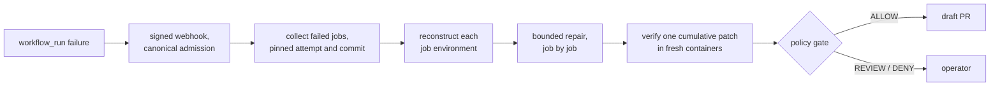

# CI Repair

CI Repair uses mini-SWE-agent to repair failed GitHub Actions runs. It collects
all failed jobs from a pinned run attempt, reconstructs supported CI environments,
repairs them in order, verifies one cumulative patch in fresh Docker containers,
and can create a gated **draft** PR. It never merges automatically.

The agent loop is mini-SWE-agent's. This project is what surrounds it: pinning the
failure, rebuilding its environment, a submit gate the model cannot talk past,
verification the agent does not control, and a policy that decides what may be
published.



## Results

Measured on the [LCA CI builds repair](https://huggingface.co/datasets/JetBrains-Research/lca-ci-builds-repair)
dataset: 39 of its 68 real CI failures (13 repositories) can be replayed offline and
are repaired by their upstream fix; each was attempted three times with
`deepseek/deepseek-flash`, 30 model calls per failed job. [Pi](https://github.com/earendil-works/pi),
a general coding agent, ran on the same tasks, images, model and budget.

| 117 trials (39 tasks × 3) | CI Repair (round 3) | Pi 0.87.1 (round 1) |
|---|---:|---:|
| Patch passes every failed job's checks in fresh containers | 111 (94.9%) | 113 (96.6%) |
| Passing patches that change only files the upstream fix changed | 111 | 112 |
| Passing patches the patch policy allows without review | 74 | 75 |
| Model calls per trial, mean | 8.6 | 11.0 |
| Estimated cost per trial, mean | $0.0058 | $0.0078 |
| Time per trial, mean | 107 s, with verification | 66 s, without |

- A general agent repairs these tasks as well as CI Repair does. What CI Repair adds
  is the path around the repair: it runs unattended from the webhook, accepted
  exactly the 111 patches the external grader passed, and separates what may be
  published automatically from what needs a person.
- Removing redundant verification cut CI Repair's mean time per trial from 227 s to
  107 s (−53%) across iterations on the same tasks, with passes going from 107 to 111.
- These are pass rates on the replayable subset of one Python dataset with one
  model, not a production success rate. Checks are the failed jobs' own commands;
  jobs that passed in the original run are not replayed.

Every number has its run, commit and limits in the [evaluation record](eval/README.md);
the [changelog](CHANGELOG.md) records each iteration's motivation, estimate and
measured outcome, including the ones that did not pay off.

## Status

The [repair lifecycle](docs/lifecycle.md) describes the current system. It is an
alpha: local tests cover the workflow, and one [live acceptance run](docs/acceptance.md)
took a real three-job failure from signed webhook to verified
[draft PR](https://github.com/0xJieREN/ci-repair-acceptance/pull/1) on a toy
repository. Unsupported workflow features fail closed.

## Run the automatic flow

Requires Python 3.12+, [uv](https://docs.astral.sh/uv/), Git,
[GitHub CLI](https://cli.github.com/) authentication, and Docker. On macOS use
Colima for the Docker engine. Keep the operator policy outside every repository
being repaired; keep model credentials private in the ignored `.env` file.

```sh
uv sync --locked
cp -n config/policy.example.yaml ~/ci-repair-policy.yaml
cp -n .env.example .env
# Edit the repository, branch, path, model and budget rules in the policy.
# Put the DeepSeek key in .env; both files must stay private.
export CI_REPAIR_WEBHOOK_SECRET=...  # the GitHub webhook secret
uv run ci-repair-webhook serve --state-dir ~/ci-repair-state \
  --policy ~/ci-repair-policy.yaml --env-file .env
```

Subscribe the GitHub webhook to **Workflow runs**, and put the listener behind
TLS. The example policy sets `publication.draft_pr: ALLOW` for the intentional
fixture. Review permissions and secrets in the target repository's branch
workflows before using it elsewhere; set the gate to `REVIEW` if publication
should require an operator. See [policy](docs/policy.md),
[environment reconstruction](docs/environment.md) and
[publication](docs/pull-requests.md).

The same run can be processed manually without the webhook:

```sh
uv run ci-repair-github OWNER/REPO RUN_ID --output runs/import
uv run ci-repair-run runs/import --policy ~/ci-repair-policy.yaml \
  --env-file .env --output runs/repair
uv run ci-repair-pr auto runs/repair --policy ~/ci-repair-policy.yaml \
  --output runs/publication
```

When the gate says `REVIEW`, an operator approves with
`ci-repair-pr prepare` and `ci-repair-pr publish` (see [publication](docs/pull-requests.md)). The
[GitHub Actions guide](docs/github-actions.md) includes an intentionally failing
fixture for a live collection smoke test.

## Verify changes

```sh
bash scripts/check.sh --unit    # fast checks without Docker
bash scripts/check.sh --colima  # macOS: full gate; stops Colima on exit
bash scripts/check.sh           # Linux/server: full gate with running Docker
```

The full gate runs locked dependency sync, lint and format checks, Docker
integration tests, and Git diff checks. GitHub Actions uses the same script.
No model API key or paid inference is needed. See
[verification boundaries](docs/verification.md) for what local tests simulate.

The repository retains the deliberately broken `examples/buggy` fixture because
the local repair tests and manual GitHub workflow use it. Local run outputs and
`.env` are Git-ignored. `config/deepseek-pricing.json` provides estimates, not
provider billing receipts. The [changelog](CHANGELOG.md) records each version:
motivation, changes, verification evidence and known limits; retired code and
data remain retrievable from Git history.
